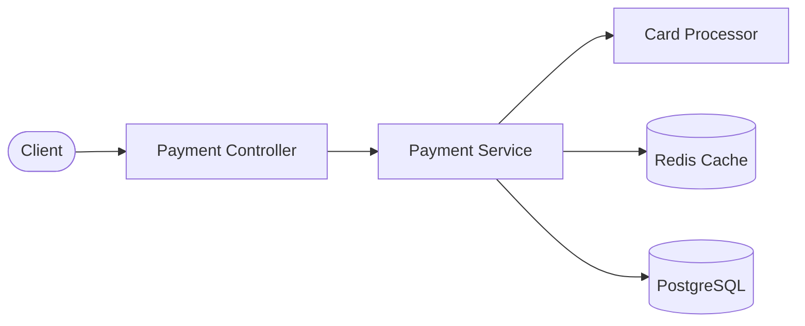

# Payment Gateway API


A payment gateway API built with Spring Boot, supporting card authorization, capture, reversal, and refund operations. Designed for **multi-tenant e-commerce platforms** with OpenAPI 3.0 documentation.

---

## Architecture



## Features

- **Multi-tenant support** — Isolate merchant data with tenant-aware queries via `X-Merchant-Id` header
- **OpenAPI 3.0** — Interactive API documentation via Swagger UI
- **Idempotency keys** — Prevent duplicate payment processing
- **Card processor abstraction** — Pluggable `CardProcessor` interface with simulated implementation for development
- **Payment lifecycle** — Full authorize > capture > refund/reverse flow with state validation
- **Redis caching** — Cache payment lookups with automatic eviction on state changes
- **Flyway migrations** — Versioned database schema management
- **RFC 7807 error responses** — Structured `ProblemDetail` error handling

## Tech Stack

| Layer         | Technology                     |
|---------------|--------------------------------|
| Language      | Java 17                        |
| Framework     | Spring Boot 3.2                |
| Database      | PostgreSQL 15                  |
| Cache         | Redis 7                        |
| Migrations    | Flyway                         |
| Containers    | Docker / Docker Compose        |
| Testing       | JUnit 5, Mockito, Testcontainers |
| Documentation | OpenAPI 3.0 / Swagger UI       |

## API Endpoints

| Method | Endpoint                       | Description              |
|--------|--------------------------------|--------------------------|
| POST   | `/api/v1/payments`             | Create a new payment     |
| GET    | `/api/v1/payments/{id}`        | Retrieve payment details |
| POST   | `/api/v1/payments/{id}/capture`| Capture an authorized payment |
| POST   | `/api/v1/payments/{id}/refund` | Refund a captured payment |
| POST   | `/api/v1/payments/{id}/reverse`| Reverse an authorized payment |

### Test Card Numbers

The simulated card processor follows standard test conventions:

| Card Last Four | Behavior           |
|----------------|--------------------|
| `4242`         | Approved           |
| `0002`         | Declined (insufficient funds) |
| `0003`         | Declined (processor error) |

## Quick Start

### Prerequisites

- Docker and Docker Compose installed

### Run with Docker Compose

```bash
git clone https://github.com/enriquevaldivia1988/payment-gateway-api.git
cd payment-gateway-api
docker-compose up -d
```

The API will be available at `http://localhost:8080` and Swagger UI at `http://localhost:8080/swagger-ui.html`.

### Example Request

```bash
curl -X POST http://localhost:8080/api/v1/payments \
  -u user:password \
  -H "Content-Type: application/json" \
  -H "X-Merchant-Id: merchant_001" \
  -H "Idempotency-Key: unique-key-123" \
  -d '{
    "amount": 2500,
    "currency": "USD",
    "cardLastFour": "4242"
  }'
```

### Local Development

```bash
# Start dependencies
docker-compose up -d postgres redis

# Build and run
./mvnw spring-boot:run

# Run tests
./mvnw test
```

## Project Structure

```
payment-gateway-api/
├── Dockerfile
├── docker-compose.yml
├── pom.xml
├── LICENSE
├── README.md
└── src/
    ├── main/java/com/codebugs/payment/
    │   ├── PaymentGatewayApplication.java
    │   ├── config/
    │   │   ├── OpenApiConfig.java
    │   │   └── SecurityConfig.java
    │   ├── controller/
    │   │   └── PaymentController.java
    │   ├── dto/
    │   │   ├── PaymentRequest.java
    │   │   └── PaymentResponse.java
    │   ├── exception/
    │   │   ├── GlobalExceptionHandler.java
    │   │   ├── PaymentNotFoundException.java
    │   │   └── PaymentStateException.java
    │   ├── model/
    │   │   ├── Payment.java
    │   │   └── PaymentStatus.java
    │   ├── processor/
    │   │   ├── CardProcessor.java
    │   │   ├── ProcessorResult.java
    │   │   └── SimulatedCardProcessor.java
    │   ├── repository/
    │   │   └── PaymentRepository.java
    │   └── service/
    │       ├── PaymentService.java
    │       └── PaymentServiceImpl.java
    ├── main/resources/
    │   ├── application.yml
    │   └── db/migration/
    │       └── V1__init_schema.sql
    └── test/java/com/codebugs/payment/
        ├── controller/
        │   └── PaymentControllerTest.java
        ├── processor/
        │   └── SimulatedCardProcessorTest.java
        ├── repository/
        │   └── PaymentRepositoryTest.java
        └── service/
            └── PaymentServiceImplTest.java
```

## Author

**Enrique Valdivia Rios**
- GitHub: [@enriquevaldivia1988](https://github.com/enriquevaldivia1988)
- LinkedIn: [enrique-valdivia-rios](https://linkedin.com/in/enrique-valdivia-rios)
- Web: [enriquevaldivia.dev](https://enriquevaldivia.dev)

## License

This project is licensed under the MIT License. See the [LICENSE](LICENSE) file for details.
